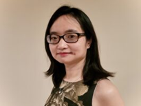
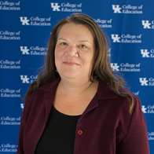

Dr. Michael Peabody is the Senior Psychometrician at the National Association of Boards of Pharmacy and holds a PhD in Educational Assessment, Evaluation, and 
Research from the University of Kentucky.  He is an active member of NCME and AERA’s Division D (Measurement and Research Methodology) and 
Division I (Education in the Professions).  Dr. Peabody is also an adjunct instructor for the Department of Educational Policy Studies & Evaluation at the 
University of Kentucky where he teaches courses on statistics and advanced psychometrics.  Currently, he serves on the editorial boards for Education in the Health Professions and the Journal of Applied Testing Technology.  
His research interests include differential item functioning, equating, standard setting, and practice analyses as well as investigating the use of 
machine learning models in psychometrics.

Dr. Ting Wang (she/her) is the Senior Psychometrician at American Board of Family Medicine. She holds PhD in Quantitative Psychology and Master’s in Statistics. 
She is interested in developing innovative methods and open source computational tools to provide new perspectives. Her research program blends psychometrics 
and Bayesian statistical modeling. The R package she developed is available in CRAN. You can find her publication and conference talk here: http://wang-ting.com. 

Dr. Kelly Bradley Dr. Kelly D. Bradley is a Professor and Chair of Educational Policy Studies and Evaluation and Program Chair for Research Methods in 
Education in the College of Education at the University of Kentucky. Her research is anchored in quantitative methods and measurement, 
with a focus on survey research and the Rasch model. She has served as chair of American Educational Research Association (AERA) Survey Research SIG, 
program chair the AERA Rasch SIG, and chair of the Educational Statisticians AERA SIG. Dr. Bradley been recognized as an outstanding advisor by 
Midwest Educational Research Association (MWERA), and her students have gone on serve in prominent roles in state education, academia, 
measurement boards, and evaluation organizations. In the college, she has served as a faculty-mentor, student research group leader, chair of COE Faculty 
Council, chair of College Promotion, Reappointment, and Tenure committee, and interim-Director of Graduate Studies. 
